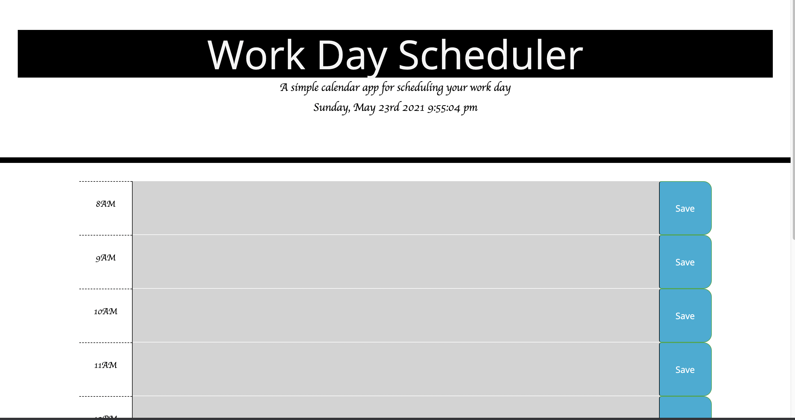

# Work Day Scheduler 
Create a simple calendar application that allows a user to save events for each hour of the day.

## Purpose
* Create a calender app that: 
   * Uses the Moment.js library to work with date and time.
   * When the planner is opened, the current day is displayed at the top of the calendar.
   * The time blocks for standard business hours is presented.
   * Each time block is color coded to indicate whether it is in the past, present or future. 
   * An event can be entered that is saved to local storage. 
   * Events still appera after the page is refreshed. 
    
## Built with 
* HTML
* JAVASCRIPT
* CSS
* BOOTSTRAP
* MOMENT.JS
* JQUERY

## Website
https://maa-hub.github.io/workScheduler/

## Contribution
Made with ❤️ by Maame

